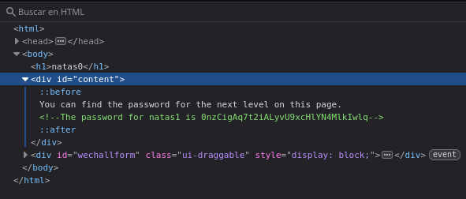

# Natas 0 – OverTheWire

El reto Natas 0 introduce los conceptos básicos de seguridad en aplicaciones web.
El objetivo es encontrar la contraseña para acceder al siguiente nivel.

La página inicial muestra únicamente un texto sencillo:

```url
You can find the password for the next level on this page.
```

## Analisis

Al inspeccionar el sitio no se observa nada relevante a simple vista.
Esto nos da la pista de que el contenido puede estar oculto en el código fuente.

Analizando el mismo nos damos cuenta del algo relevante. Directamente hemos encontrado la contraseña para el siguiente nivel.



## Conclusion

- Siempre es útil revisar el código fuente de una página.

- Muchas veces la información sensible queda expuesta en los comentarios de HTML.

>[!CAUTION]
>En este ejercicio si voy a mostrar la contraseña del siguiente nivel, en futuros problemas estará censurada.
