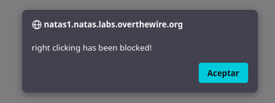
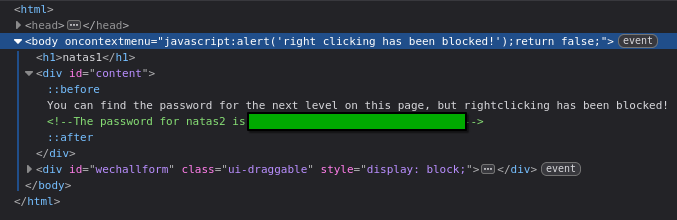

# Natas 1 – OverTheWire

En este nivel, la página muestra el el siguiente mensaje:

```url
You can find the password for the next level on this page, but rightclicking has been blocked! 
```

Lo que quiere decir que esta vez no vamos a poder entrar al modo **inspeccionar** o ver el **código fuente** con el ratón. 

Si lo intentas veras que te sale el siguiente mensaje por pantalla:



## Analisis

La protección consiste en un script JavaScript que bloquea el uso del click derecho.
Este tipo de restricción es cosmética y no evita que el contenido esté disponible en el navegador.

### Entonces ¿Como podemos entrar?

Hay varias formas de hacerlo:

- Los navegadores tienen una combinacion de teclas o una tecla para entrar en el modo inspeccion, estas son las 2 más comunes:
  - `F12`
  - `Ctrl + Shift + I`

- Sabemos que lo que bloque el uso del click derecho es js, los navegadores actuales desactivar el uso de javascript, lo que nos permitiría entrar sin problema. 

>[!NOTE]
>Esto se hace desde la configuracion del navegador, dependiendo del navegador se hace de diferente manera, lo mejor es que busques como desactivarlo para tu navegador. 

Una vez podamos entrar al modo **inspeccion** revisaremos el código como lo hemos hecho en el ejercicio anterior, encontraremos lo siguiente: 



## Conclusion

- Las restricciones basadas en JavaScript no son medidas de seguridad reales.

- El contenido en el HTML entregado por el servidor siempre puede inspeccionarse.

- Aprendemos que debemos distinguir entre seguridad real y seguridad por obscuridad.
