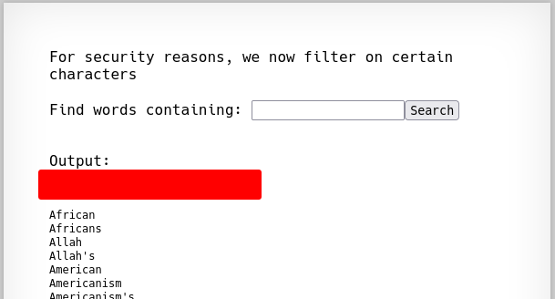

# Natas 10 – OverTheWire

La página vuelve a mostrar un formulario de búsqueda (igual que en Natas 9). Pero ahora, en el código, vemos que intentan filtrar la entrada:

```php
$needle = $_GET["needle"];
if(preg_match('/[;|&]/',$needle)) {
    print "Input contains an illegal character!";
} else {
    passthru("grep -i $needle dictionary.txt");
}
```

## Análisis

Se utiliza grep otra vez para buscar en el diccionario.

Esta vez el código prohíbe `;`, `|` y `&` con una expresión regular.

Eso bloquea la inyección más evidente (; cat /etc/passwd).

Pero no filtran otros caracteres como `$(...)` o las redirecciones.
En Bash, `$(...)` ejecuta un comando y sustituye su salida.

Ejemplo:

```bash
grep test$(ls) dictionary.txt
```

Esto ejecuta `ls` dentro de `$(...)`.

Podemos usar esta técnica para leer el archivo con la contraseña:

```bash
test$(cat /etc/natas_webpass/natas11)
```

Como resultado, la salida del comando cat aparece en el HTML con la contraseña.



Este ejercicio es bastante parecido al anterior lo unico que cambia es este pequeño `bypass`

## Concepto: Bypass de filtros en Command Injection

En este nivel vemos un ejemplo de blacklist filtering:

- El programador intentó bloquear solo ; | &.
- Pero el shell tiene muchas más formas de ejecutar comandos:
  - `$(...)`
  - backticks: `command`
  - `||` y `&&`
  - Redirecciones `<`, `>`

>[!IMPORTANT]
>Intentar protegerse con listas negras casi siempre falla.

## Conclusion

- Los filtros parciales son inseguros: siempre habrá un bypass.
- Mejor usar listas blancas estrictas o evitar por completo la concatenación de entradas en comandos.
- Entender los operadores del shell es clave para detectar vulnerabilidades.
