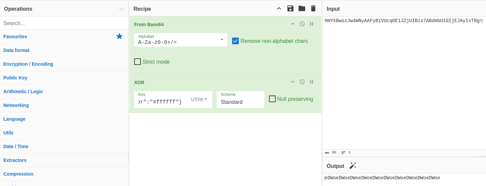
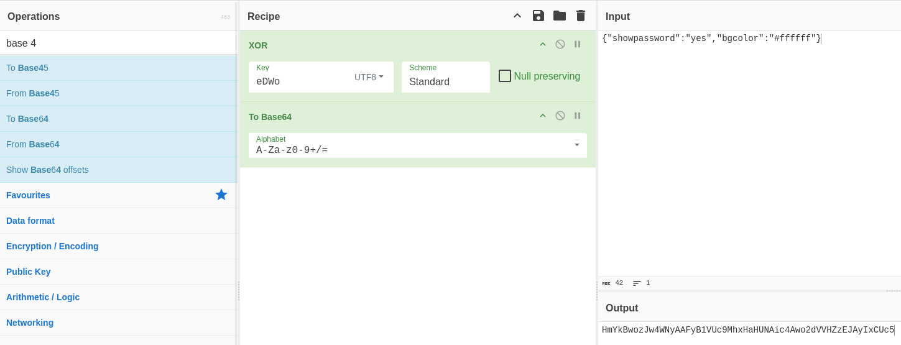

# Natas 11 – OverTheWire

La página muestra un formulario con un checkbox para activar o no la "debug mode".
En el código fuente vemos algo interesante:

```php
$defaultdata = array( "showpassword"=>"no", "bgcolor"=>"#ffffff");
```

Después se observa que estos datos se guardan en una cookie llamada data, pero pasan primero por una función de **cifrado XOR** con una clave secreta.

```php
function xor_encrypt($in) {
    $key = "random_key"; // el valor real no se muestra
    $outText = '';
    for($i=0;$i<strlen($in);$i++) {
        $outText .= $in[$i] ^ $key[$i % strlen($key)];
    }
    return $outText;
}
```

## Analisis

La cookie data contiene un JSON (`{"showpassword":"no","bgcolor":"#ffffff"}`) que ha sido **XOR-eado** con una clave secreta y luego codificado en Base64.

Para tener acceso, necesitamos que `"showpassword":"yes"`.

Como el algoritmo de XOR es simétrico, si conocemos pares texto **claro** ↔ **cifrado**, podemos deducir la clave.

Y aquí tenemos suerte: sabemos el valor por defecto `(showpassword=no)`, por lo que podemos calcular la clave XOR y usarla para modificar el valor.

### Concepto: Cifrado XOR

El XOR (eXclusive OR, “O exclusiva”) es una operación lógica a nivel de bits:

| Bit A | Bit B | A XOR B |
| ----- | ----- | ------- |
| 0     | 0     | 0       |
| 0     | 1     | 1       |
| 1     | 0     | 1       |
| 1     | 1     | 0       |

Es decir, devuelve 1 solo si los bits son diferentes.

**¿Cómo se usa en criptografía?**

Se puede usar para “cifrar” datos combinando cada byte del texto original con un byte de una clave:

```url
TextoCifrado = TextoPlano XOR Clave
```

Y como la operación es reversible:

```url
TextoPlano = TextoCifrado XOR Clave
```

Esto significa que conociendo cualquiera de los dos (**texto plano** ↔ **cifrado**) y la clave, puedes obtener el otro.
Y si conoces un trozo del texto plano y el cifrado, puedes deducir la clave.

Teniendo esto en cuenta vamos a descifrar nuestra cookie, para ello se puede hacer en local creando nuestro propio porgrama o como lo voy a hacer yo, usando la herramienta online de `CyberChef`.

Esta herramienta permite a los usuarios codificar, decodificar, cifrar, transformar y analizar datos de manera sencilla y estructurada a través de una interfaz web intuitiva.

Teniendo esto en cuenta y sabiendo lo que hay que hacer, que es desencriptar nuestra cookie y pasarla de base64 a XOR para ver cual es la clave, ponemos lo siguiente.



Como key dentro del apartado de **XOR** ponemos `{"showpassword":"no","bgcolor":"#ffffff"}`.

Como vemos nuestra key es la palabra eDWo(Se repite constantemente lo mismo)

Sabiendo esto ahora vamos a volver a hacer el proceso original pero vamos a usar de key `eDWo` y como input `{"showpassword":"yes","bgcolor":"#ffffff"}`



Copiamos esta nueva cookie, la intercambiamos por la nuestra y al darle F5 veremos lo siguiente:


## Conclusion

- Nunca usar XOR “casero” como método de cifrado.
- La **seguridad por ofuscación** no es seguridad real.
- Si conoces texto claro y cifrado, revertir XOR es trivial.
