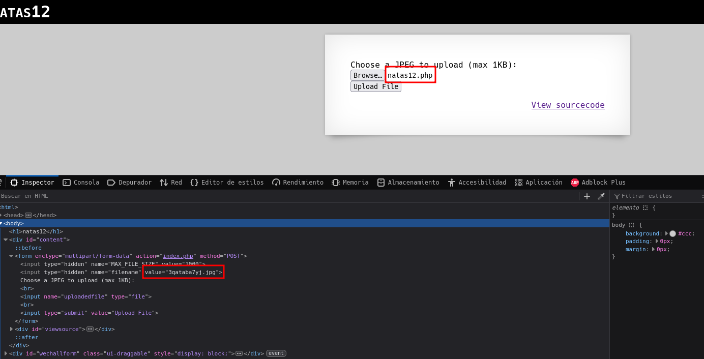
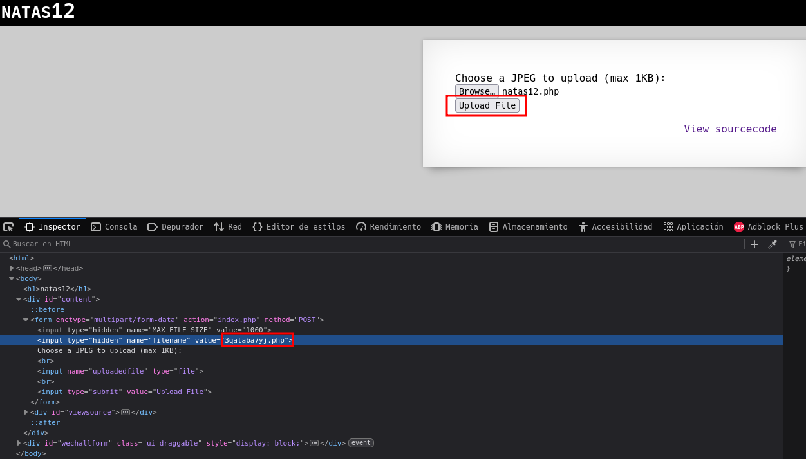
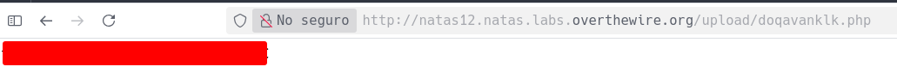

# Natas 12 – OverTheWire

Nos muestran un formulario de subida de archivos (upload). Aparentemente quiere una imagen, pero el comportamiento real del servidor es la clave del reto.

## Analisis

Patrones típicos de fallos en uploads:

- Validación solo del lado cliente (JavaScript o `accept="image/*"`), no del servidor.

- Comprobaciones débiles del nombre de archivo (p. ej. solo mirar que contenga `.jpg`).

- Guardar el archivo subido en una ruta accesible públicamente y luego mostrar un enlace al resultado (p. ej. `/upload/<nombre>`).

Si el servidor no valida bien, podemos subir un .php y ejecutarlo visitando su URL.

Teniendo en cuenta esto lo que vamos a hacer es crear una archivo .php para ver si la web lo admite. El contenido de este archivo va a ser un `cat` a `/etc/natas_webpass/natas12`

>[!NOTE]
>`exec()` es una función de PHP que permite ejecutar comandos del sistema operativo directamente desde el script.

Sabiendo que la página no comprueba que estes subiendo realmente un .jpeg vamos a crear un script en php con el siguiente código.

```php
<?php echo exec("cat /etc/natas_webpass/natas13"); ?>
```

Ahora lo que hacemos es subirlo a la página y nos abrimos el modo desarrollador.



Como vemos el archivo que hemos subido con el código mencionado anteriormente se llama `natas12.php` pero si nos vamos al modo inspeccion vemos que se va a guardar como `<nombreAleatorio>.jpg`, como el servidor no tiene una comprobacion de que se está subiendo lo que vamos a hacer es guardarlo como una archivo `.php` para ello, en el propio html cambiamos el valor de `.jpg` a `.php` y le damos a `Upload File`



Una vez le damos a `Upload File` vemos que la página nos devuelve un link con la ruta de nuestro archivo, al hacerle click veremos que nos lleva a un archivo `.php` el cual nos muestra la contraseña del siguiente nivel.



### Concepto: File Upload Insecurity

- Riesgo: si puedes subir y ejecutar código (p. ej. `.php`) en el servidor, obtienes **RCE** (ejecución remota de comandos).
- Motivos comunes:

  - Validación débil o solo cliente.
  - Filtro de extensión por cadena (no por tipo real/magic bytes).
  - Almacenar los ficheros subidos en directorios ejecutables del servidor.

- Buenas prácticas:

  - Validación servidor estricta (lista blanca de tipos, tamaño, análisis de contenido).
  - Reescritura de nombres y almacenamiento fuera del docroot.
  - Servir los uploads estáticos desde un servidor que no ejecute código (o con `AddType`/`php_admin_flag` bloqueados).
  - Verificación de magic bytes y, si es imagen, usar librerías que re-encodeen el archivo.

## Conclusion

- Subidas de archivos mal validadas → ejecución de código.
- La diferencia entre “parece imagen” y “es realmente una imagen válida” es crítica.
- Nunca confíes en la validación del lado cliente.
