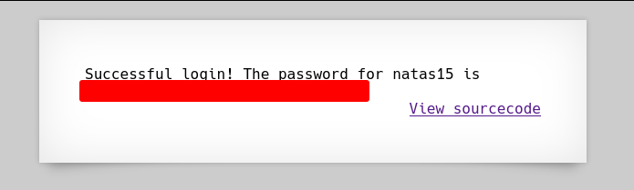

# Natas 14 – OverTheWire

El nivel presenta un formulario de login con campos `username` y `password`.

## Analisis

El código fuente (visible o deducible por los mensajes) usa una consulta SQL parecida a:

```php
$query = "SELECT * FROM users WHERE username='" . $_POST["username"] . "' AND password='" . $_POST["password"] . "'";
```

Esto es vulnerable a **inyección SQL**, ya que los datos del usuario se concatenan directamente en la consulta sin sanitización.

### Concepto: La inyección SQL

Ocurre cuando una aplicación web construye consultas a una base de datos insertando directamente datos del usuario sin validarlos ni sanitizarlos adecuadamente.

Esto permite que un atacante manipule la consulta SQL original, cambiando su lógica para:

- Acceder a información no autorizada.
- Modificar o eliminar datos.
- Incluso tomar control completo del sistema.

#### Ejemplo básico

Supongamos que tenemos un formulario de login con este código PHP:

```php
<?php
$user = $_POST['username'];
$pass = $_POST['password'];

$query = "SELECT * FROM users WHERE username='$user' AND password='$pass'";
```

Si el usuario introduce:

```txt
username = admin
password = 1234
```

La consulta que se ejecuta es:

```sql
SELECT * FROM users WHERE username='admin' AND password='1234';
```

Todo correcto, esto es lo que sucedería normalmente. Ahora vamos con una **Inyeccion SQL (SQLi)**

Si el atacante escribe en el campo de usuario:

`admin' OR '1'='1`

y deja el campo de contraseña vacío, la consulta se convierte en:

```sql
SELECT * FROM users WHERE username='admin' OR '1'='1' AND password='';
```

Como `'1'='1'` siempre es verdadero, la base de datos devuelve todos los registros → acceso sin contraseña.

Esto ocurre porque el código del servidor concatenó directamente los datos del usuario dentro del comando SQL, sin comprobar su contenido.
El intérprete SQL no sabe que esa parte venía de un input: lo interpreta como código legítimo.

#### Tipos de Iyecciones SQL

| Tipo                              | Descripción                                                                                                 | Ejemplo                                                |
| --------------------------------- | ----------------------------------------------------------------------------------------------------------- | ------------------------------------------------------ |
| **Clásica (o directa)**           | La aplicación muestra directamente los resultados o errores SQL.                                            | `admin' --`                                            |
| **Ciega (Blind SQLi)**            | No se muestran errores, pero se puede inferir información por el comportamiento (tiempo, respuestas, etc.). | `admin' AND SUBSTRING(password,1,1)='a' --`            |
| **Basada en tiempo**              | Se usan funciones como `SLEEP()` para deducir datos midiendo tiempos de respuesta.                          | `' OR IF(SUBSTRING(password,1,1)='a', SLEEP(5), 0) --` |
| **Basada en unión (UNION-based)** | Se usan `UNION SELECT` para combinar resultados de otras tablas.                                            | `' UNION SELECT username,password FROM users --`       |

Sabiendo todo esto lo que vamos a hacer es poner en campo del usuario la inyeccion clásica: `" or 1=1-- -`

>[!NOTE]
>Existen varios tipos teniendo en cuenta que servidor sql se está usando, además de que tambien varia si se usa `"` o `'`

Vamos que la páginas nos responde con la contraseña de Natas15



## conclusion

- **Inyección SQL** ocurre cuando los datos del usuario se usan directamente en una consulta sin escapar.
- Solución: usar **consultas preparadas (prepared statements)** o funciones de escape (`mysqli_real_escape_string()`).
- **Nunca confíes en la entrada del usuario**
