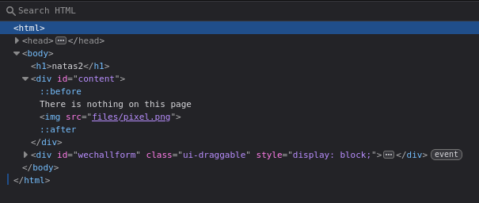
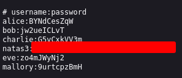

# Natas 2 – OverTheWire

En este nivel, al acceder a la página vemos un simple mensaje:

```url
There is nothing on this page
```

No se muestra ninguna pista visible.

## Analisis

Como siempre como ha simple vista no vemos ninguna pista o nada "interesante" no que vamos a hacer es estrar al modo **inspeccion**

En el código fuente de la página encontramos una referencia a una imagen:



Esto nos sugiere que puede existir un directorio accesible públicamente `/files`.

Teniendo esto en cuenta vamos a poner en la url la siguiente ruta:
`http://natas2.natas.labs.overthewire.org/files/`

Esto nos llevará a un directorio donde aparecerá
- `La imagen(nada importante)`
- `Una fichero llamado Users.txt`

Dentro de este fichero encontraremos lo siguiente:



## Conclusion

- Aunque una página no muestre nada interesante, **los recursos enlazados pueden ser clave.**

- Es importante probar accesos directos a directorios relacionados.

- Enumerar rutas y ficheros es una técnica fundamental en pentesting web.