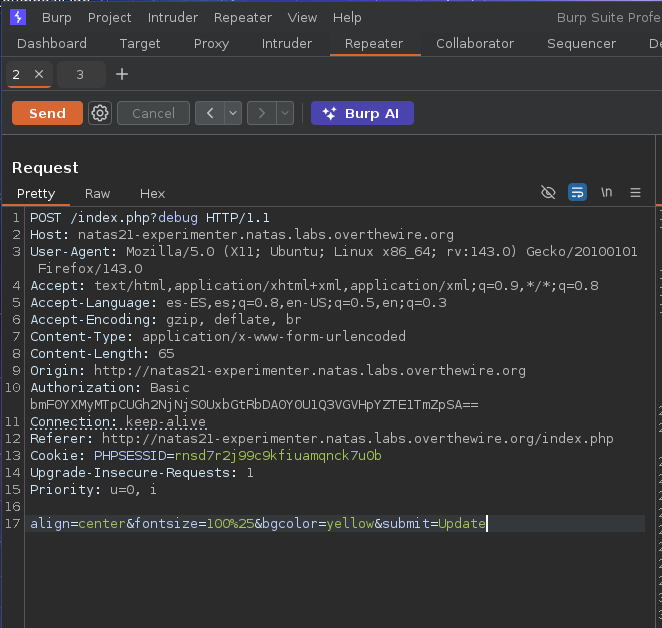
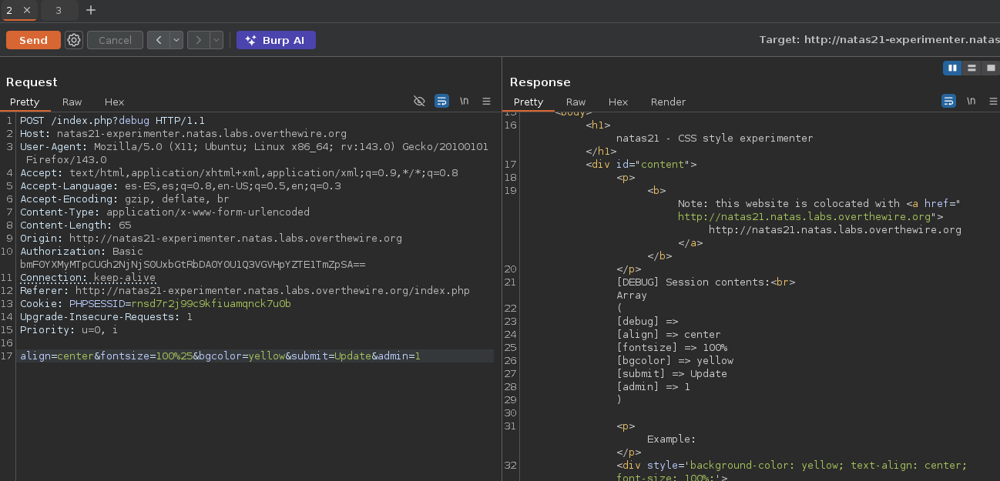
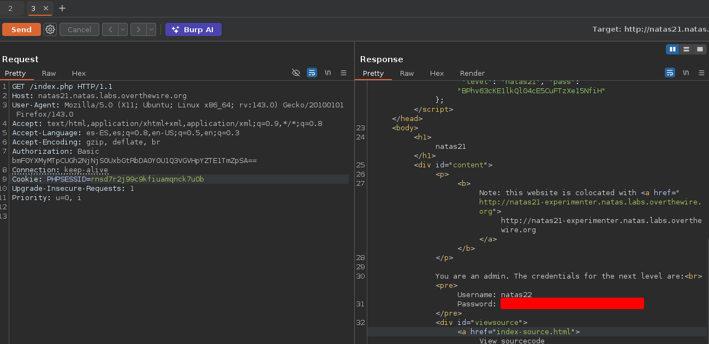

# Natas 21 – OverTheWire

En este nivel tenemos dos aplicaciones distintas que comparten las mismas sesiones PHP:

- Sitio principal:
`http://natas21.natas.labs.overthewire.org/`
- Sitio secundario (experimenter):
`http://natas21-experimenter.natas.labs.overthewire.org/`

Nuestro objetivo es **obtener acceso como administrador** en el sitio principal

## Analisis

El sitio principal nos muestra:

```url
You are logged in as a regular user.
```

Mientras que el sitio experimenter tiene un formulario que permite enviar variables arbitrarias:

```url
color=blue
admin=1
submit=1
```

El punto clave está en que **ambas páginas comparten el mismo almacenamiento de sesiones** (`/tmp/sess_<PHPSESSID>`).
Por tanto, si en el experimenter modificamos `$_SESSION["admin"]=1`, esa variable también será visible desde el sitio principal.

### Concepto: Sesiones compartidas entre aplicaciones

Ambos subdominios (`natas21` y `natas21-experimenter`) usan el mismo `PHPSESSID`.
Esto significa que los dos leen y escriben sobre el mismo archivo de sesión.

Si una de las aplicaciones (experimenter) permite al usuario **modificar libremente las variables de sesión, puede usarse para escalar privilegios** en la otra (la principal).

### ¿Qué es Burp Suite?

Burp Suite es una herramienta profesional para **análisis, interceptación y modificación de tráfico HTTP/S.**
Permite interceptar las peticiones del navegador antes de que lleguen al servidor, modificarlas, reenviarlas y observar las respuestas.
Es ampliamente utilizada en **pentesting web, CTFs** y auditorías de seguridad.

Si no sabes usarlo te recomiendo ver un video para aprender, ya que si me pongo yo a exlpicarlo en este writeup sería muy largo.

Sabiendo que ambos `PHPSESSID` se comparte vamos a interceptar y modificar la peticicion en la web experimental y añadir `admin = 1`, así que para ello vamos a usar burpsuite.

Lo primero es mandar al repetear de burpsuite la peticion de `submit` de la página experimental.



Una vez aquí lo que hacemos es mandar como un parámetro `admin=1` y veremos que si ponemos el modo debug en la peticion este nos aparecerá como un parámetro introducido en la respuesta del servidor



Teniedo esta peticion hecha lo que vamos a hacer es copiar nuestro `PHPSESSID` y vamos a mandar una solicitud a nuestra página principal con este `id` copiado.



Como vemos si ponemos el `id` con el cual hemos hecho nuestra pequeña inyeccion de parámetro en la página principal este nos devolverá la contraseña del siguiente nivel.

## Conclusion

- Las sesiones compartidas entre aplicaciones deben **aislarse** siempre.
- No confíes en que otro subdominio “seguro” mantenga la integridad de las variables.
- Burp Suite es una herramienta poderosa para interceptar, entender y explotar tráfico HTTP/S.
