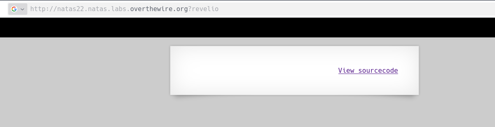
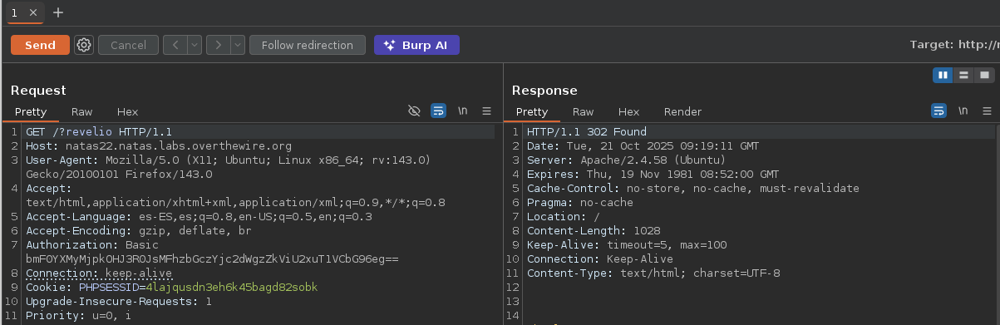
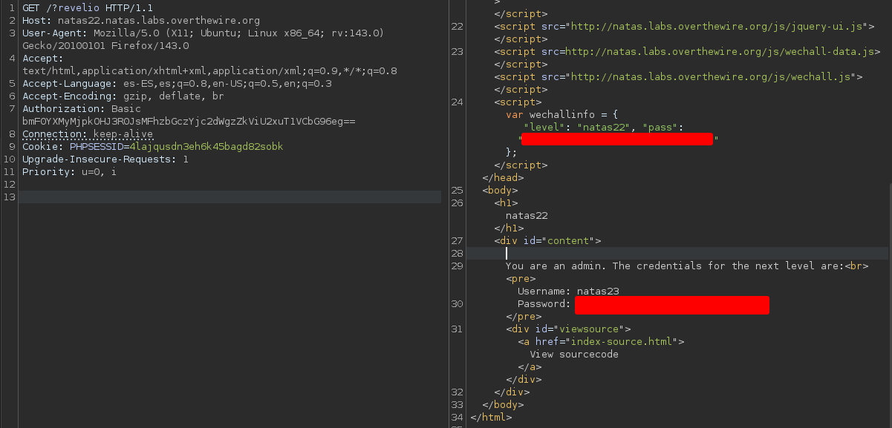

# Natas 22 – OverTheWire

En este nivel, la página parece vacía y no muestra nada útil.
Sin embargo, si observas el tráfico, verás que la aplicación redirecciona automáticamente con un código HTTP 302 Found (redirect).

El truco consiste en detener esa redirección para ver el contenido original de la respuesta — donde se encuentra la contraseña del siguiente nivel.

## Analisis

Como vemos en el código fuente, la web tiene un parámetro de entrada llamda `?revelio`:

```php
if(array_key_exists("revelio", $_GET)) {
    // only admins can reveal the password
    if(!($_SESSION and array_key_exists("admin", $_SESSION) and $_SESSION["admin"] == 1)) {
    header("Location: /");
    }
```

Vamos a ponerla en nuestro navegador a ver que es lo que pasa.



Vemos que aparentemente este parametro lo unico que hace es redirigirnos al mismo sitio, al sitio inicial. Para estar seguros vamos a capturar una peticion del index.html con `burpsuite` y luego vamos a añadirle el `?revelio` en la peticion.



Como vemos nos devuelve un código de estado `302`, y dentro de la misma está la contraseña del siguiente nivel.



### Concepto: HTTP 302 y redirecciones

- HTTP 302 Found indica que la página quiere redirigirte a otra URL.
- El navegador o cliente HTTP sigue automáticamente esa redirección, descartando el cuerpo original.
- Pero ese cuerpo sigue existiendo y puede contener datos sensibles (como aquí).

Por eso, al interceptar la respuesta o desactivar el “follow redirect”, podemos ver el contenido oculto.

## Conclusion

- Los códigos 3xx (**redirecciones**) pueden contener información sensible.
- Es buena práctica **no** incluir datos confidenciales en el **cuerpo de una redirección**.
- En auditorías, **inspecciona siempre las respuestas 3xx antes de dejar que el cliente** siga el redireccionamiento.
- Burp Suite es ideal para visualizar y analizar este tipo de comportamientos.
