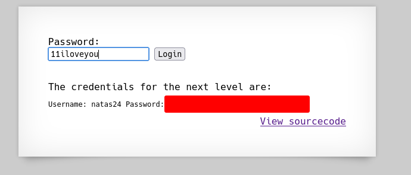

# Natas 23 – OverTheWire

Al entrar al nivel, vemos un campo donde se puede enviar el parámetro passwd.
El código fuente del nivel muestra lo siguiente:

```php
<?php
    if(array_key_exists("passwd",$_REQUEST)){
        if(strstr($_REQUEST["passwd"],"iloveyou") && ($_REQUEST["passwd"] > 10 )){
            echo "<br>The credentials for the next level are:<br>";
            echo "<pre>Username: natas24 Password: <censored></pre>";
        }
        else{
            echo "<br>Wrong!<br>";
        }
    }
    // morla / 10111
?>
```

## Analisis

Para acceder a la contraseña, deben cumplirse dos condiciones simultáneamente:

1. `strstr($_REQUEST["passwd"], "iloveyou")` ➜ La cadena introducida debe contener la palabra "iloveyou".
2. `($_REQUEST["passwd"] > 10)` ➜ El valor de passwd debe ser mayor que 10.

El problema (y el reto) está en la segunda condición.
`$_REQUEST["passwd"]` es un string, pero PHP lo compara con un entero `(10)`.

### Concepto: Comparaciones no tipadas en PHP

PHP realiza conversiones automáticas de tipo cuando compara un número con una cadena.
Esto significa que:

- Si el string empieza con un número, PHP convierte la parte inicial en número.
    Ejemplo:

    ```php
    "11test" > 10  // true, porque se convierte en 11
    ```

- Si el string no empieza con un número, PHP lo convierte a 0.
    Ejemplo:

    ```php
    "iloveyou" > 10  // false, porque se convierte en 0
    ```

Por tanto, nuestro objetivo es crear una cadena que:

- Contenga `"iloveyou"` (para pasar la primera condición),
- Y empiece con un número mayor que `10` (para pasar la segunda).

Probemos algo como:

```php
11iloveyou
```

- Contiene `"iloveyou"`
- Empieza con 11, que es mayor que `10`

PHP interpretará esa comparación así:

```php
( int("11iloveyou") > 10 ) → ( 11 > 10 ) → true
```



## Conclusion

- Las comparaciones débiles en PHP pueden ser tan peligrosas como las comparaciones de hashes mal tipadas.
- Siempre valida el tipo de los datos antes de compararlos con un número.
- Una simple diferencia entre `==` y `===` o entre `>` y una **validación de tipo** puede marcar la diferencia entre seguridad y vulnerabilidad.
