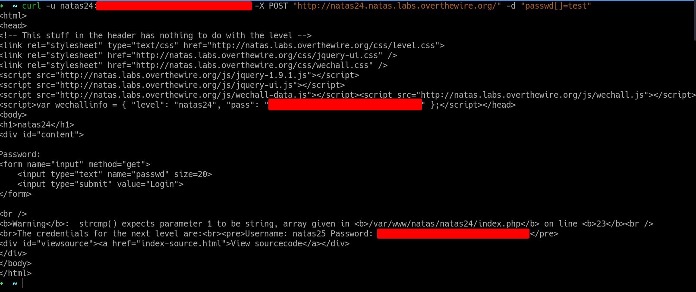

# Natas 24 – OverTheWire

La página pide una contraseña (passwd).
Si aciertas, te muestra las credenciales para Natas 25.
Si fallas, responde simplemente:

```url
Worng!
```

En el código fuente vemos que se usa strcmp de esta forma:

```php
if(!strcmp($_REQUEST["passwd"], "<censored>")){
    // código
}
```

## Analisis

### ¿Qué hace `strcmp`?

`strcmp($a, $b)`:

- Devuelve 0 si las cadenas son exactamente iguales.
- Devuelve un número < 0 si $a < $b.
- Devuelve un número > 0 si $a > $b.

Eso significa:

- Si `strcmp(...)` devuelve `0` → entramos al if.
- Si devuelve cualquier otro valor (ej. -1, 1, etc.) → `!algo` = `false` → “Wrong!”.

Hasta aquí todo bien… siempre que `$_REQUEST["passwd"]` sea una **cadena**.

### ¿Dónde está la vulnerabilidad?

`$_REQUEST` no solo recoge parámetros “limpios”:
puede contener valores de `GET`, `POST` o `COOKIE`, e incluso **arrays**, si enviamos algo como:

`passwd[]=test`

¿Y qué pasa si llamamos a strcmp con un array en vez de un string?

```php
strcmp(["test"], "<censored>")
```

En PHP esto lanza un warning del tipo:
->strcmp() expects parameter 1 to be string, array given

Entonces esto nos devuelve NULL o 0 según versión/comportamiento interno.
Sea como sea, el error no se muestra en la página y el valor de retorno se considera “falsy” o 0, y entonces se evalúa como true, se entra en el `if` aunque no sepamos la contraseña.

vamos a hacerlo con el comando `curl`:

```bash
curl -u natas24:<ContraseñaNatas24> -X POST "http://natas24.natas.labs.overthewire.org/" -d "passwd[]=test"
```

y con esto tenemos la contraseña del siguente nivel:



## Conclusion

- Un código aparentemente seguro puede fallar si no se valida el tipo de los datos de entrada.
- PHP hace conversiones automáticas peligrosas si no se programa con cuidado.
- Errores ocultos (warnings) pueden abrir la puerta a bypasses de autenticación.
- La validación estricta y el uso correcto de superglobales es crucial.
