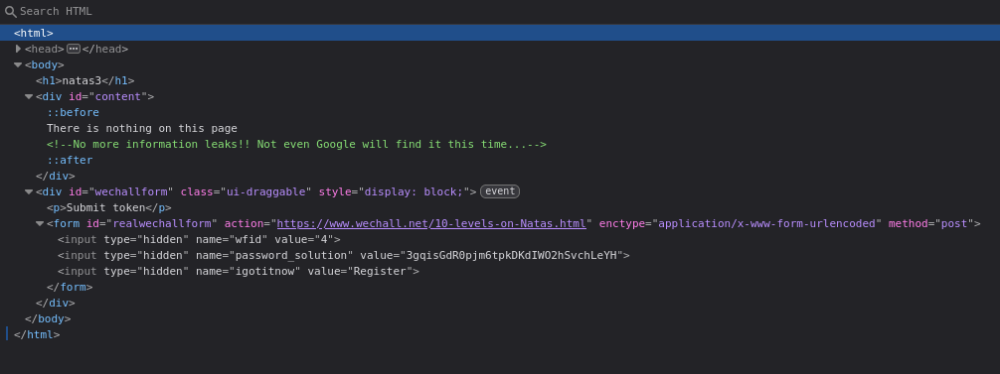
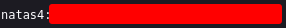

# Natas 3 – OverTheWire

En este nivel, al acceder a la página vemos un simple mensaje:

```url
There is nothing on this page
```

No se muestra ninguna pista visible.

## Analisis

Como siempre como ha simple vista no vemos ninguna pista o nada "interesante" no que vamos a hacer es estrar al modo **inspeccion**.
Esta vez no vamos a encontrar nada que nos llame la atencion:



Bueno ese comentario es algo peculiar, `Not even Google will find it this time...`

La frase "Not even Google will find it" hace referencia al archivo ***robots.txt***, que se utiliza para indicar a los motores de búsqueda qué rutas no deben indexar.

### ¿Qué es robots.txt?

El archivo robots.txt es un archivo de texto ubicado normalmente en la raíz de un sitio web (ejemplo: `https://example.com/robots.txt`).
Su función principal es indicar a los motores de búsqueda (como Google, Bing, etc.) qué partes del sitio deberían o no ser indexadas.

Ejemplo típico:

```url
User-agent: *
Disallow: /admin/
```

Esto le dice a todos los robots que no indexen la carpeta /admin/.

>[!IMPORTANT]
>robots.txt no es un mecanismo de seguridad, solo es una “sugerencia” para los buscadores.
>Cualquiera puede leerlo manualmente y descubrir rutas que el administrador preferiría ocultar.

Teniendo todo esto en cuenta, nos da la pista de que puede haber algo oculto en ese archivo.

Accedemos a `http://natas3.natas.labs.overthewire.org/robots.txt`

Y encontraremos lo siguiente:

```url
User-agent: *
Disallow: /s3cr3t/
```

Entramos a la ruta descubierta: `http://natas3.natas.labs.overthewire.org/s3cr3t/`

Veremos lo siguiente:



## Conclusion

- Revisar siempre los comentarios HTML en busca de pistas.

- Conocer el uso de archivos comunes como *robots.txt* o *.htaccess*, que pueden revelar rutas sensibles.

- La seguridad no debe basarse en ocultar recursos, ya que pueden descubrirse fácilmente.
