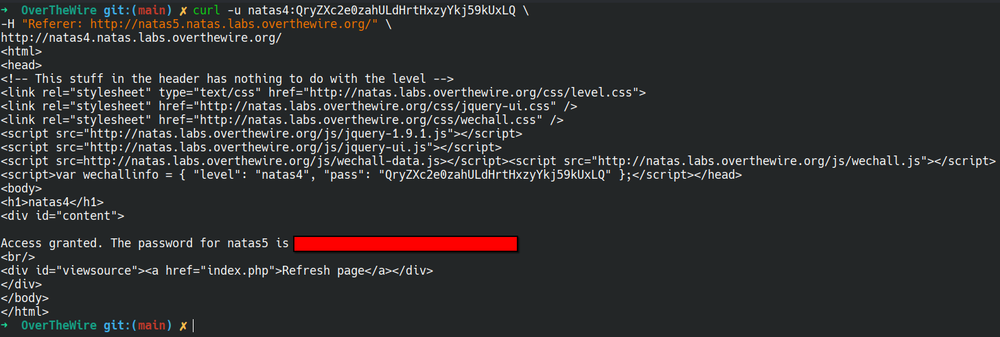

# Natas 4 – OverTheWire

La página principal muestra este mensaje:

```url
Access disallowed. You are not visiting from http://natas5.natas.labs.overthewire.org/
```

Nos está diciendo claramente que solo podemos acceder a la página si la petición proviene desde Natas 5.

## Analisis

Esto hace referencia a la cabecera HTTP llamada **Referer**.
Los sitios web pueden comprobar esta cabecera para saber desde qué URL llegaste a la página.

En este caso, si el Referer no coincide con `http://natas5.natas.labs.overthewire.org/`, la página bloquea el acceso.

### ¿Qué es la cabecera `Referer`?

La cabecera **Referer** es una parte de la petición HTTP que indica desde qué página proviene el usuario.
Ejemplo: si en `example.com` haces click en un enlace hacia `test.com`, la petición incluirá:

```url
Referer: http://example.com
```

>[!CAUTION]
>Como el cliente puede modificarla fácilmente, no debe usarse como método de seguridad.

Para modificar estas cabeceras vamos a usar la herramientas `curl`

Podemos usar **curl** con la opción `-H` para añadir cabeceras personalizadas:

```bash
curl -u natas4:<contraseña_de_natas3> \
-H "Referer: http://natas5.natas.labs.overthewire.org/" \
http://natas4.natas.labs.overthewire.org/

```

Esto nos devuelve el HTML de la página junto con la contraseña del siguiente nivel.



## Conclusion

- Las cabeceras HTTP son fácilmente manipulables por el cliente.

- No deben usarse como un método de seguridad ni de autenticación.

- Herramientas como curl, Burp Suite o las DevTools de navegador permiten manipular cabeceras sin dificultad.
