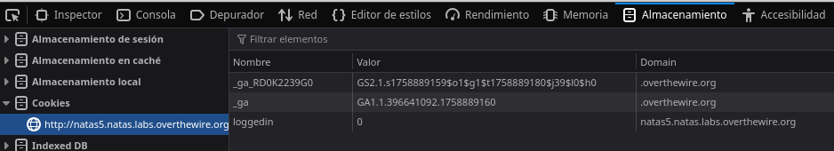
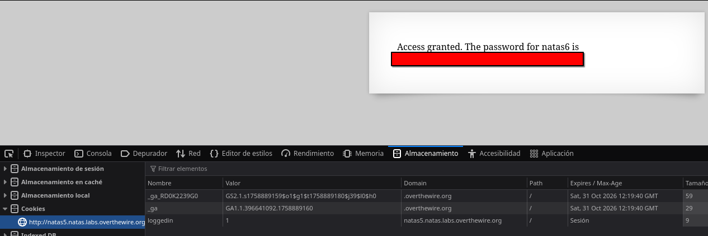

# Natas 5 – OverTheWire

La página principal muestra el siguiente mensaje:

```url
Access disallowed. You are not logged in
```

Esto sugiere que el acceso depende de algún **mecanismo de autenticación**.

## Analisis

Al inspeccionar el código fuente, no encontramos nada relevante. El siguiente paso es revisar qué *cookies* está enviando el servidor al navegador.

Para ello vamos a `DevTools` → pestaña `Application / Storage` → sección `Cookies`.

Una vez aquí veremos lo siguiente:



Vemos que hay una cookie llamada:

```url
loggedin=0
```

Esto indica que el usuario no está autenticado.

Para resolver el problema lo que tenemos que hacer es modificar ese 0 de loggein por un 1, lo más sencillo es hacerlo con el navegador ya que simplemente tenemos que hacer click, poner 1 y recargar la página.



Este proceso tambien lo podremos hacer mediante el comando curl, ya que tiene el manejo de cookies:

```bash
curl -u natas5:<contraseña_de_natas4> \
--cookie "loggedin=1" \
http://natas5.natas.labs.overthewire.org/
```

### ¿Qué son las Cookies?

Las cookies son pequeños fragmentos de información que un servidor web envía al navegador del usuario. Se utilizan principalmente para:

-Recordar sesiones de usuario (login).
-Guardar preferencias (idioma, tema oscuro, etc.).
-Mantener el estado entre peticiones HTTP (que son sin estado por naturaleza).

Ejemplo de cookie en una respuesta HTTP:

```url
Set-Cookie: sessionid=12345; Path=/; HttpOnly
```

Ejemplo de cookie enviada por el navegador en la siguiente petición:

```url
Cookie: sessionid=12345
```

>[!IMPORTANT]
>Si las cookies no están protegidas, el usuario puede modificarlas fácilmente desde el navegador.
>Por eso deben ir firmadas o almacenarse de forma segura en el servidor.

## Conclusion

- Las cookies permiten que el servidor recuerde al usuario entre peticiones.

- No deben usarse cookies simples sin validación para controlar acceso.

- Este reto muestra un caso de gestión de sesión insegura, muy común en aplicaciones mal diseñadas.
