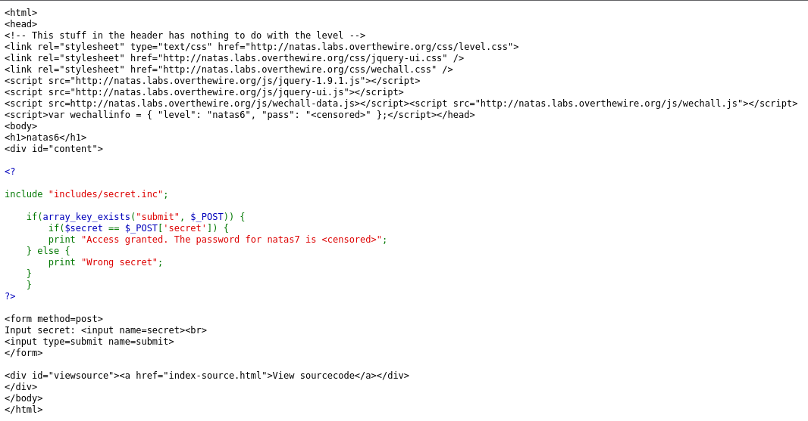
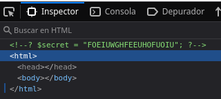
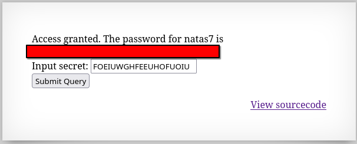

# Natas 6 – OverTheWire

La página muestra un formulario con un campo de texto y un botón de submit.

Ademas de esto tambien tenemos un link que pone `View sourcecode` que cuando pulsamos nos lleva al siguiente contenido:



## Analisis

Vemos que el script que comprueba si la contraseña puesta dentro del campo es correcta hace referencia a un archivo desde `includes/secret.inc`

Vamos a intentar entrar a esta ruta desde la url:

```url
http://natas6.natas.labs.overthewire.org/includes/secret.inc
```

Está todo en blanco, pero hemos entrado, vamos a curiosear un poco más desde el `DevTool` (F12).

Nos encotramos lo siguiente:



Este código lo ponemos dentro del campo que teniamos en primero lugar y nos saldrá el sigueinte mensaje:



### Archivos de inclusión en PHP

En PHP, es común usar include o require para reutilizar código.
Ejemplo:

```php
include("config.php");
```

Esto inserta el contenido de config.php dentro del script actual.

>[!IMPORTANT]
>Si el archivo de inclusión está accesible públicamente en el servidor, un atacante puede leerlo y obtener información sensible (como contraseñas o claves secretas).
>
>Por eso, los archivos de configuración deben almacenarse fuera del directorio accesible por el servidor web.

## Conclusion

- Siempre revisar los archivos incluidos en un script web, pueden exponer secretos.

- No se deben dejar credenciales o información sensible en archivos accesibles desde el navegador.

- Este nivel enseña un fallo típico de **information disclosure** en aplicaciones PHP.
