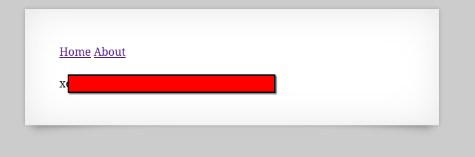

# Natas 7 – OverTheWire

Al acceder a la página principal, se nos muestran dos enlaces:

- `Home` → `index.php?page=home`

- `About` → `index.php?page=about`

Esto nos da una pista clara: el sitio carga contenido dinámicamente en función del parámetro page.

## Analisis

Este tipo de implementación es vulnerable si el valor de page se incluye directamente en el código sin validación, por ejemplo:

```php
<?php
include($_GET['page'].".php");
?>
```

Esto se conoce como **Local File Inclusion (LFI)**, ya que nos permite manipular el parámetro para cargar archivos arbitrarios en el servidor.

Recordemos además la pista que aparecía en el nivel anterior:

`password for webuser natas8 is in /etc/natas_webpass/natas8`

Así que nuestro objetivo es leer ese archivo mediante `LFI`.

### Concepto: Local File Inclusion (LFI)

Un LFI ocurre cuando una aplicación web incluye archivos locales (del propio servidor) de forma dinámica en función de parámetros controlados por el usuario.

Ejemplo vulnerable en PHP:

```php
$page = $_GET['page'];
include($page.".php");
```

Si no hay validación, el atacante puede inyectar rutas arbitrarias:

```url
?page=/etc/passwd
```

>[!CAUTION]
>Usando correctamente esta vulnerabilidad podemos usarla para el robo de contraseñas o configuraciones (/etc/passwd, /etc/shadow, config.php).
>Ejecución de código si se combina con técnicas de log poisoning o subida de ficheros.

Teniendo lo aprendido en cuenta, vemos que en la página se usa ?page=home o ?page=about, probamos a pasar una ruta absoluta del servidor:

`http://natas7.natas.labs.overthewire.org/index.php?page=/etc/natas_webpass/natas8`

El servidor interpreta el valor de page e incluye el archivo indicado.

Como resultado, se muestra el contenido del fichero con la contraseña.


