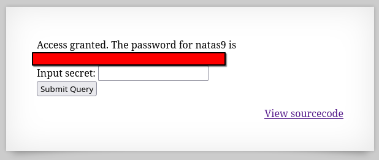

# Natas 8 – OverTheWire

La página muestra un formulario que pide introducir un secret.
En el código fuente encontramos la siguiente función PHP:

```php
<?
include "includes/secret.inc";

if(array_key_exists("secret", $_POST)) {
    if($secret == $_POST['secret']) {
        print "Access granted. The password for natas9 is <censored>";
    } else {
        print "Wrong secret";
    }
}
?>
```

Dentro de `includes/secret.inc` está definida una función para generar el secreto:

```php
<?
function encodeSecret($secret) {
    return bin2hex(strrev(base64_encode($secret)));
}
?>
```

El valor esperado del secreto ya está codificado en el código.
Para resolver el reto, debemos entender cómo se genera y luego revertirlo.

## Analisis

La función aplicada es:

`base64_encode($secret)` → convierte a Base64.

`strrev(...)` → invierte el string resultante.

`bin2hex(...)` → convierte cada byte en su valor hexadecimal.

Por tanto, para encontrar el secreto necesitamos revertir estas operaciones en orden inverso:

`hex2bin()` → para volver del hex a bytes.

`strrev()` → invertir de nuevo.

`base64_decode()` → obtener el valor original.

En PHP (o en cualquier lenguaje que soporte estas funciones) podemos hacer la reversión.
Ejemplo en PHP:

```php
<?php
$encoded = "3d3d516343746d4d6d6c315669563362"; // valor que aparece en el código
echo base64_decode(strrev(hex2bin($encoded)));
?>
```

Esto devuelve el secreto original



### Concepto: Encoding ≠ Encryption

Este nivel muestra la diferencia entre codificación y encriptación:

- **Codificación (encoding)** → transformar datos a otro formato (ej. Base64, hex). No busca seguridad, solo representación.

- **Encriptación (encryption)** → transformar datos de forma reversible solo con una clave. Busca confidencialidad.

Aquí se usó encoding (Base64 + Hex) que cualquiera puede revertir.

## Conclusion

- Al analizar funciones de transformación, piensa en el orden de operaciones y cómo invertirlas.

- Encoding no protege secretos.

- Siempre que encuentres funciones sospechosas en PHP (base64_encode, bin2hex, strrev, etc.), prueba a revertirlas.
