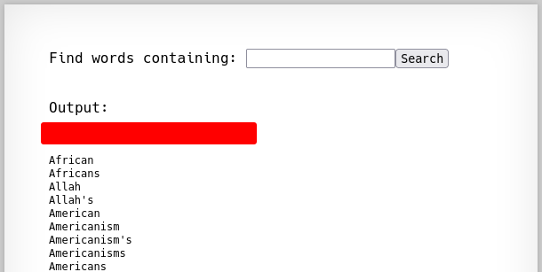

# Natas 9 – OverTheWire

La página muestra un formulario de búsqueda (search). Al enviar una palabra, la app devuelve coincidencias desde un diccionario.

## Analisis

Si inspeccionamos el código (o los mensajes) se deduce que el servidor ejecuta un comando del sistema parecido a:

```php
passthru("grep -i " . $_GET["needle"] . " dictionary.txt");
```

El valor `needle` se concatena directamente en el comando sin sanitización → **Command Injection**.
En shells, caracteres como `;`, `|`, `&&` permiten encadenar comandos.

Nuestro objetivo es leer:

`/etc/natas_webpass/natas10`

### Concepto: Command Injection (Inyección de comandos)

Ocurre cuando entradas de usuario se insertan en una llamada al sistema (p. ej. `exec`, `system`, `passthru`) sin validación.

- Símbolos peligrosos: `;`, `|`, `||`, `&&`, backticks ``command`` , $(...).
- Impacto: ejecución arbitraria de comandos; lectura de archivos sensibles; pivot para *RCE*.

Mitigaciones:

- No usar concatenación; preferir funciones seguras o listas blancas.
- Escapar/validar estrictamente la entrada (aceptar solo patrones esperados).
- Evitar llamar al shell: usar APIs nativas en lugar de comandos del sistema.

Teniendo esto en cuenta vamos a inyectar un segundo comando usando `;`:

```url
test; cat /etc/natas_webpass/natas10
```

Tras el resultado del grep, aparecerá el contenido del fichero con la contraseña de Natas 10.



## Conclusion

- Nunca concatenes entrada de usuario en comandos del sistema.
- Conocer los metacaracteres de shell te ayuda a identificar (y explotar) estas fallas.
- La defensa real es no invocar el shell salvo que sea imprescindible.
